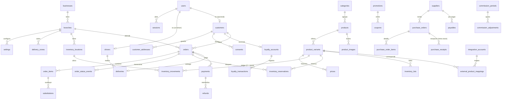

# Modelo de datos — Market Castilla

Fuente de verdad: `src/db/schema.ts` (Drizzle ORM sobre PostgreSQL 16). Todos los ids son `text` con prefijo (`ord_`, `pay_`, `mov_`, …) generados en `src/lib/ids.ts`.

## Invariantes transversales

1. **Stock físico = Σ `inventory_movements.qty`.** El ledger es la fuente de verdad; no existe una columna "stock" editable.
2. **Disponible = físico − Σ reservas activas** (`inventory_reservations.status = 'active'`).
3. **Prohibido editar stock sin movimiento.** Cualquier corrección (conteo, merma, conciliación POS) es un movimiento `adjustment`/`shrinkage` con motivo y autor; la importación CSV concilia por delta, nunca pisa el número.
4. **Dinero: enteros COP.** Nunca float; porcentajes en basis points (`tax_rate_bps`, `rate_pct_bps`, 1000 bps = 10%).
5. **Peso/volumen: gramos/mililitros enteros** (`qty`, `actual_weight_g`, `estimated_weight_g`, `unit_size`).
6. **Idempotencia de pagos:** único `(provider, idempotency_key)` — un reintento del checkout devuelve el mismo pago.
7. **Dedupe de webhooks:** único `(provider, external_event_id)` en `webhook_events` — un evento repetido no hace nada.
8. **Pedidos de marketplace únicos** por `(channel, marketplace_order_id)`.
9. **Números legibles:** secuencia `order_number_seq` (creada en el seed, inicia en 1001) → `orders.number = "MC-1001"`, único.
10. **Toda mutación crítica** (precios, inventario, reembolsos, settings, comisión, pagos) escribe en `audit_events`.

## Tablas

### Núcleo del negocio

| Tabla | Propósito | Columnas clave | Índices / únicos | Relaciones |
|---|---|---|---|---|
| `businesses` | Razón social del negocio | `name`, `legal_name`, `tax_id` (NIT, pendientes) | PK | ← `branches` |
| `branches` | Sucursal (hoy una, en Bogotá) | `city` (default "Bogotá"), `timezone` (`America/Bogota`), `is_active` | PK | → `businesses`; ← `settings`, `orders`, `delivery_zones`, `inventory_locations`, `expenses`, `cash_sessions` |
| `settings` | Configuración clave-valor versionable (nada hardcodeado: horarios, tolerancias, base de comisión, reglas de restringidos, sinónimos) | `key`, `value` (jsonb validado con Zod), `updated_by`, `updated_at` | único `(branch_id, key)` | → `branches` (null = global) |

### Usuarios y permisos

| Tabla | Propósito | Columnas clave | Índices / únicos | Relaciones |
|---|---|---|---|---|
| `users` | Cuentas del sistema (8 roles: customer, cashier, picker, admin, driver, accountant, tech_admin, owner) | `email`, `password_hash` (scrypt), `role`, `is_active`, `mfa_enabled` | único `email` | ← `sessions`, `drivers`, `customers` |
| `role_permissions` | Matriz de permisos materializada (semilla desde `src/lib/auth/permissions.ts`, editable por el owner) | `role`, `permission` | PK compuesta `(role, permission)` | — |
| `sessions` | Sesiones en BD, revocables | `expires_at`, `revoked_at` | índice `user_id` | → `users` |

### Clientes

| Tabla | Propósito | Columnas clave | Índices / únicos | Relaciones |
|---|---|---|---|---|
| `customers` | Cliente (con o sin usuario; `user_id` null = invitado) | `phone`, `birth_date`, `age_verified_at`, `segments` (jsonb) | índice `phone` | → `users?`; ← `customer_addresses`, `consents`, `orders`, `loyalty_accounts` |
| `customer_addresses` | Direcciones guardadas | `address_line`, `neighborhood`, `zone_id`, `reference_notes`, `is_default` | índice `customer_id` | → `customers` |
| `consents` | Consentimientos con evidencia auditable (Ley 1581/2012) | `kind` (`marketing_whatsapp`, `age_terms`, `data_processing`…), `granted`, `source`, `detail` (jsonb) | índice `(customer_id, kind)` | → `customers` |

### Catálogo

| Tabla | Propósito | Columnas clave | Índices / únicos | Relaciones |
|---|---|---|---|---|
| `categories` | Categorías con área de preparación | `slug`, `prep_area`, `is_restricted`, `sort_order` | único `slug` | ← `products`, `promotions` |
| `products` | Producto comercial | `slug`, `search_terms` (sinónimos jsonb), `is_restricted`, `restricted_rule_key` (`liquor`, `cigarettes`) | único `slug`; índice `category_id` | → `categories`; ← `product_variants`, `product_images` |
| `product_variants` | **Unidad vendible: precio y stock cuelgan de aquí.** | `sale_unit` (unit/pack/kg/g/l/ml/lb), `unit_size`, `sold_by_weight`, `estimated_weight_g`, `price_cop`, `compare_at_cop`, `cost_cop`, `tax_rate_bps`, `barcode`, `physical_location` | índice `product_id`; único `sku`; índice `barcode` | → `products`; ← inventario, `order_items`, `prices`, mapeos externos |
| `product_images` | Imágenes ordenadas | `url`, `alt`, `sort_order` | índice `product_id` | → `products` |
| `prices` | Historial de precios: cada cambio crea una fila (auditable) | `price_cop`, `starts_at`, `ends_at`, `created_by` | índice `variant_id` | → `product_variants` |

### Inventario

| Tabla | Propósito | Columnas clave | Índices / únicos | Relaciones |
|---|---|---|---|---|
| `inventory_locations` | Ubicaciones físicas ("Sala de ventas", "Bodega") | `is_default` | PK | → `branches` |
| `inventory_lots` | Lotes de perecederos (FEFO, vencimientos) | `lot_code`, `expires_at`, `qty_received`, `qty_remaining` | índices `variant_id`, `expires_at` | → `product_variants`, `inventory_locations` |
| `inventory_movements` | **Ledger, fuente de verdad del stock.** `qty` + entrada / − salida, en unidad de venta (unidades, g o ml) | `type` (purchase_receipt/sale/adjustment/shrinkage/return_in/return_out/transfer/initial), `reason`, `reference_type` + `reference_id`, `created_by` | índices `variant_id`, `(reference_type, reference_id)` | → `product_variants`, `inventory_locations`, `inventory_lots?` |
| `inventory_reservations` | Reservas por pedido; disponible = ledger − activas | `qty`, `status` (active/consumed/released), `resolved_at` | índices `(variant_id, status)`, `order_id` | → `product_variants`; `order_id` referencia lógica a `orders` |

### Proveedores y compras

| Tabla | Propósito | Columnas clave | Índices / únicos | Relaciones |
|---|---|---|---|---|
| `suppliers` | Proveedores | `tax_id`, contacto | PK | ← `purchase_orders`, `payables` |
| `purchase_orders` | Órdenes de compra | `status` (draft/sent/partially_received/received/cancelled), `expected_at` | índice `supplier_id` | → `suppliers`; ← items, recepciones |
| `purchase_order_items` | Líneas de la orden | `qty_ordered`, `unit_cost_cop` | índice `purchase_order_id` | → `purchase_orders`, `product_variants` |
| `purchase_receipts` | Recepción de mercancía. **El inventario aumenta SOLO al recibir, nunca al crear la orden** | `received_at`, `received_by` | índice `purchase_order_id` | → `purchase_orders` |
| `payables` | Cuentas por pagar a proveedores | `invoice_number`, `amount_cop`, `paid_cop`, `due_at` | índice `supplier_id` | → `suppliers`, `purchase_orders?` |

### Pedidos

| Tabla | Propósito | Columnas clave | Índices / únicos | Relaciones |
|---|---|---|---|---|
| `orders` | Pedido, cabecera del vertical slice | `number` (MC-1001), `channel` (web_pwa/whatsapp/rappi/didi/social/manual/pos_physical), `status` (14 estados), `fulfillment` (delivery/pickup), datos de entrega, `substitution_pref` + límite, `has_weight_items`, `is_estimated_total`, flags de restringidos (`has_restricted_items`, `age_declared_birth_date`, `age_terms_accepted_at`, `id_check_required`, `id_checked_at`), totales COP (`items_total_cop`, `discount_cop`, `delivery_fee_cop`, `tax_cop`, `tip_cop`, `total_cop`), `marketplace_order_id` + `marketplace_commission_cop` | único `number`; único `(channel, marketplace_order_id)`; índices `status`, `customer_id`, `(channel, created_at)` | → `branches`, `customers?`; ← `order_items`, `order_status_events`, `payments`, `deliveries` |
| `order_items` | Líneas con snapshot de nombre y precio | `qty` (unidades/g/ml), `unit_price_cop` (por unidad o por kg), `line_total_cop`, `actual_weight_g`, `final_line_total_cop` (null hasta pesar), `note`, `is_restricted`, `prep_area` | índice `order_id` | → `orders`, `product_variants`; ← `substitutions` |
| `order_status_events` | Historial completo de transiciones (máquina de estados de `orders/state.ts`) | `from_status`, `to_status`, `actor_user_id`, `actor_label`, `reason` | índice `order_id` | → `orders` |
| `substitutions` | Propuestas de sustitución de productos agotados | `status` (proposed/accepted/rejected/auto_applied), `price_diff_cop`, `decided_at` | índice `order_item_id` | → `order_items` |

### Pagos

| Tabla | Propósito | Columnas clave | Índices / únicos | Relaciones |
|---|---|---|---|---|
| `payments` | Intentos de pago | `provider` (sandbox/offline/…), `method`, `status` (pending/approved/rejected/expired/refunded/partially_refunded), `amount_cop`, `idempotency_key`, `provider_ref`, `attempts` (jsonb con historial de intentos/webhooks), `approved_at` | **único `(provider, idempotency_key)`**; índices `order_id`, `provider_ref` | → `orders`; ← `refunds` |
| `webhook_events` | Eventos de webhook procesados (dedupe) | `payload` (jsonb), `processed_at` | **único `(provider, external_event_id)`** | — |
| `refunds` | Reembolsos totales o parciales (ej. diferencia de peso) | `amount_cop`, `reason` (weight_diff/cancellation/complaint), `status`, `created_by` | índice `payment_id` | → `payments` |

### Delivery

| Tabla | Propósito | Columnas clave | Índices / únicos | Relaciones |
|---|---|---|---|---|
| `delivery_zones` | Zonas de cobertura por barrios (MVP sin polígonos) | `neighborhoods` (jsonb), `fee_cop`, `min_order_cop`, `free_delivery_from_cop`, `eta_minutes_min/max`, `slot_capacity` | índice `branch_id` | → `branches` |
| `drivers` | Domiciliarios | `vehicle`, `is_available` | PK | → `users`; ← `deliveries` |
| `deliveries` | Entrega de un pedido | `confirmation_code` (prueba de entrega que da el cliente), `proof_photo_url`, `payment_received_method` (contraentrega), `incidents` (jsonb), timestamps assigned/picked_up/delivered | **único `order_id`** (1:1 con pedido); índice `(driver_id, status)` | → `orders`, `drivers?` |

### Promociones y fidelización

| Tabla | Propósito | Columnas clave | Índices / únicos | Relaciones |
|---|---|---|---|---|
| `promotions` | Reglas de descuento (percent/fixed/two_for_one/combo/category_percent/free_delivery) | `value` (bps o COP según `kind`), inclusiones/exclusiones, `min_purchase_cop`, `max_uses`/`used_count`, `budget_cop`/`spent_cop`, `time_window`, `excludes_restricted`, `stackable`, vigencia | PK | → `categories?`; ← `coupons` |
| `coupons` | Cupones por código (por cliente o de campaña) | `code`, `max_uses`, `used_count`, `expires_at` | único `code` | → `promotions`, `customers?` |
| `loyalty_accounts` | Saldo de puntos por cliente | `points_balance` | único `customer_id` | → `customers`; ← `loyalty_transactions` |
| `loyalty_transactions` | Ledger de puntos (+ acumula, − redime) | `points`, `reason`, `order_id` | índice `account_id` | → `loyalty_accounts` |

### Gastos, caja y notificaciones

| Tabla | Propósito | Columnas clave | Índices / únicos | Relaciones |
|---|---|---|---|---|
| `expenses` | Gastos del negocio | `concept`, `amount_cop`, `category`, `incurred_at` | PK | → `branches` |
| `cash_sessions` | Apertura/cierre de caja | `opening_cop`, `closing_cop`, `expected_cop` | PK | → `branches` |
| `notifications` | Mensajes salientes (WhatsApp/email). Cola inspectable del MVP; el proveedor "console" los deja en `simulated` | `channel`, `recipient`, `template`, `body`, `status` (queued/sent/simulated/failed) | índice `order_id` | referencias lógicas a `orders`/`customers` |

### Integraciones y sincronización

| Tabla | Propósito | Columnas clave | Índices / únicos | Relaciones |
|---|---|---|---|---|
| `integration_accounts` | Cuentas de integración (pos_treinta/rappi/didi/wompi/whatsapp) | `encrypted_credentials` (**siempre cifradas, AES-GCM previsto; nunca texto plano**), `status` (not_connected/sandbox/live), `config` (jsonb) | único `kind` | ← `external_product_mappings` |
| `external_product_mappings` | Mapeo SKU interno ↔ producto externo | `external_id`, `external_name` | único `(integration_id, external_id)`; índice `variant_id` | → `integration_accounts`, `product_variants` |
| `sync_jobs` | Corridas de sincronización (import POS, export ventas) | `kind`, `status` (pending/running/completed/completed_with_errors/failed), `summary` (jsonb), `errors` (jsonb fila a fila) | índice `(kind, created_at)` | — |

### Auditoría y comisión

| Tabla | Propósito | Columnas clave | Índices / únicos | Relaciones |
|---|---|---|---|---|
| `audit_events` | Auditoría de mutaciones críticas (`price.update`, `inventory.adjust`, `refund.create`, `settings.update`, `commission.period_created`, `payment.*`, `order.weight_recorded`) | `actor_user_id`, `actor_label`, `action`, `entity_type` + `entity_id`, `before`/`after` (jsonb) | índices `(entity_type, entity_id)`, `(action, created_at)` | — |
| `commission_periods` | Periodos de comisión de agencia con **snapshot inmutable** del cálculo | `label`, `period_start/end`, `status` (open/pending_approval/approved/closed), `snapshot` (jsonb, desglose por canal), `rate_pct_bps`, `commission_cop` (bigint), `approved_by`/`approved_at` | único `(period_start, period_end)` | ← `commission_adjustments` |
| `commission_adjustments` | Ajustes manuales (+ a favor de agencia, − del negocio) | `amount_cop`, `reason`, `created_by` | índice `period_id` | → `commission_periods` |

## Diagrama entidad-relación (principal)

Tablas sin FK dibujada pero enlazadas por referencia lógica: `webhook_events` (dedupe de `payments`), `notifications` (`order_id`/`customer_id`), `sync_jobs` (referenciada por `inventory_movements.reference_id`), `audit_events` (`entity_type` + `entity_id` genéricos), `expenses` y `cash_sessions` (solo `branch_id`).
